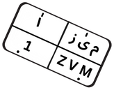

# Plate-Price-Prediction

##  Project Structure

```sh
└── Plate-Price-Prediction/
    ├── README.md
    ├── data
        └── mergedData.csv # The main dataset
    │   └── data_marge.ipynb 
    └── preprocessing
        ├── PanelPlatform3.csv
        ├── cleaning.ipynb
        ├── lohatk_cleaned.csv
        ├── lu7ah.csv
        ├── lu7ah_cleand.csv
        ├── mazad.csv
        ├── mazad1.csv
        ├── mazad_1_cleand.csv
        ├── mazad_2_cleand.csv
        ├── mergedData.csv
        ├── mstaml_cleand.csv
        └── vip_cleand.csv
```
# ميَّز | Mayyiz



## 🧠 About the Project

**Mayyiz (ميَّز)** is a license plate pricing assistant designed to solve the ever-growing curiosity around how Saudi license plates are priced. With the rise of unique plate auctions on platforms like *Absher*, people started wondering:  
> **"Is this plate worth its price?"**

Mayyiz analyzes the market to predict plate prices and reveals the characteristics that make a plate valuable.

---

## 🎯 Why This Project?

We asked: _How do people price license plates?_  
Our goal is to make this process transparent using data. Mayyiz identifies and evaluates common price indicators such as:

- Number of digits or letters
- Repetition of digits or letters
- Presence of names, adjectives, or culturally significant letters
- Tribal initials or codes
- Special dates (birthdays, historic events)
- Sequential patterns
- Government-related numbers (e.g., 911)

---

## 🧰 Tech Stack & Tools

- **Web Scraping** from:
  - Absher  
  - Lo7a.com  
  - Haraj  
  - Mosta'mal  

- **Data Cleaning & Analysis:**  
  - `Pandas`, `NumPy`  
  - `Seaborn`, `Matplotlib`  

- **Model Used:**  
  - Weighted Average Cosine Similarity

---

## 📊 Data Analysis & Preprocessing

Steps taken to clean and analyze the data:

- Removed illogical values such as "على السوم", 0, or 1 (excluding data from Absher)
- Dropped non-contributing columns
- Reorganized dataset for better structure
- Removed duplicate entries
- Observed a lack of consistent pricing patterns across the market

---

## 💻 Try It Yourself

We built a web app using **Streamlit** where you can test your license plate and get:

- **Highest price**
- **Lowest price**
- **Average estimated price**

> ⚠️ If the plate contains only one character/number or isn’t considered “special”, you’ll receive a message suggesting to purchase a more unique plate.

🔗 [**Try the app here**](https://mayyiz-license-plates.streamlit.app/)

---

## 📌 Features

- Bilingual UI: Arabic and English
- Lightweight prediction model
- Clean and intuitive design (Streamlit)
- Smart messaging for non-valuable plates

---

## 📷 Preview

_Add a screenshot or GIF here if desired._  
Currently displaying logo only.

---

## 🤝 Contributing

This is a personal data science project.  
Contributions and suggestions are welcome for future iterations.

---

## 📬 Contact

**Sultan Alqasami**  
📧 sultanalqasami@gmail.com  
🔗 [LinkedIn](https://www.linkedin.com/in/sultan-al-qasami-b19a77283)

---
